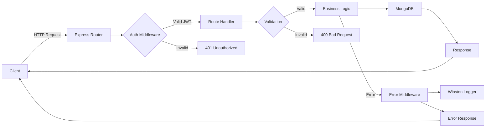

# Node.js Learning V1

A comprehensive Node.js learning repository following the "Node.js: The Complete Guide to Build RESTful APIs (2018)" course by Mosh Hamedani. This repository contains 15 progressive chapters covering Node.js fundamentals through advanced topics including Express.js, MongoDB, authentication, testing, and deployment.

Built in November 2018 as a hands-on learning resource for mastering Node.js and building production-ready RESTful APIs.

## Features

- 📚 15 structured chapters covering Node.js from basics to deployment
- 🚀 Express.js web framework and middleware
- 🗄️ MongoDB integration with Mongoose ODM
- 🔐 Authentication and authorization with JWT
- ✅ Unit and integration testing with Jest
- 🛡️ Error handling and logging with Winston
- 📦 Package management and NPM
- 🎯 Complete movie rental API project (Vidly)
- 🧪 Test-Driven Development examples
- 🌐 Production deployment best practices

## Getting Started

### Prerequisites

- Node.js (v8.11.3 or higher)
- npm (v5 or higher)
- MongoDB (for chapters 07-15)
- VSCode (recommended IDE)

### Installation

1. Clone the repository:
```bash
git clone https://github.com/orassayag/nodejs-learning-v1.git
cd nodejs-learning-v1
```

2. Navigate to any chapter and install dependencies:
```bash
cd 05/express-demo
npm install
```

3. Run the example:
```bash
npm start
```

## Project Structure

```mermaid
graph TD
    A[Node.js Learning V1] --> B[Fundamentals 01-06]
    A --> C[Database 07-09]
    A --> D[Security 10-11]
    A --> E[Testing 12-14]
    A --> F[Deployment 15]
    
    B --> B1[01: Node.js Basics]
    B --> B2[02: Modules]
    B --> B3[03: NPM]
    B --> B4[04: Express Intro]
    B --> B5[05: Express Advanced]
    B --> B6[06: Async Operations]
    
    C --> C1[07: MongoDB Basics]
    C --> C2[08: MongoDB Advanced]
    C --> C3[09: Relations & Refs]
    
    D --> D1[10: Authentication]
    D --> D2[11: Error Handling]
    
    E --> E1[12: Unit Testing]
    E --> E2[13: Integration Testing]
    E --> E3[14: TDD]
    
    F --> F1[15: Production Deploy]
    
    A --> G[Complete Projects]
    G --> G1[node-vidly: Full API]
```



## Chapter Overview

### Fundamentals (Chapters 01-06)

#### 01 - Node.js Basics
Introduction to Node.js runtime, global objects, and core concepts.

#### 02 - Modules
Understanding the module system, creating and exporting modules.

#### 03 - NPM & Packages
Package management, semantic versioning, and creating packages.
- `npm-demo/` - NPM basics
- `node-app/` - Simple Node application
- `lion-lib/` - Custom package example

#### 04 - Express Basics
Introduction to Express framework and basic routing.

#### 05 - Express Advanced
Configuration, environments, debugging, templating engines (Pug), and middleware.
- Environment-based configuration
- Debugging with the `debug` package
- Templating with Pug
- Built-in and custom middleware

#### 06 - Async Operations
Asynchronous patterns: callbacks, promises, and async/await.

### Database Integration (Chapters 07-09)

#### 07 - MongoDB Basics
MongoDB setup, CRUD operations, and Mongoose basics.
- `mongo-demo/` - Basic operations
- `exercise1-3/` - Practice exercises

#### 08 - MongoDB Advanced
Data validation, schema design, and complex queries.
- `mongo-demo/` - Advanced queries
- `node-vidly/` - Vidly project with MongoDB

#### 09 - MongoDB Relations
Modeling relationships, embedding vs referencing, population, and ObjectIds.
- `embedding/` - Embedded documents
- `relations-demo/` - Relationship patterns
- `population/` - Population examples
- `node-vidly-fawn/` - Transactions with Fawn
- `node-vidly-object-id/` - ObjectId operations

### Security & Error Handling (Chapters 10-11)

#### 10 - Authentication & Authorization
User registration, password hashing (bcrypt), JWT tokens, and authorization middleware.
- User authentication flow
- JWT token generation and validation
- Role-based access control

#### 11 - Error Handling
Centralized error handling, logging with Winston, and uncaught exception handling.
- Express error middleware
- Winston logging to files and MongoDB
- Handling async errors

### Testing (Chapters 12-14)

#### 12 - Unit Testing
Unit testing with Jest, mocking dependencies, and code coverage.
- `testing-demo/` - Jest basics
- `node-vidly-testing/` - Unit tests for Vidly

#### 13 - Integration Testing
API integration testing with Jest and Supertest.
- Testing HTTP endpoints
- Database operations in tests
- Test environment configuration

#### 14 - Test-Driven Development
TDD methodology and practices.
- Write tests first
- Red-Green-Refactor cycle
- Better code design through TDD

### Deployment (Chapter 15)

#### 15 - Production Deployment
Production readiness, environment configuration, logging, and deployment.
- `node-vidly-deployment/` - Deployment prep
- `node-vidly-deployment-last/` - Final production version
- Compression middleware
- Helmet for security headers
- Environment-based configuration
- Production logging setup

## Complete Project: Vidly API

The Vidly movie rental API evolves throughout chapters 08-15, demonstrating a complete RESTful API with:

### Features
- 🎬 Movie genres and catalog management
- 👥 Customer management
- 📀 Rental system with validation
- 🔐 User authentication and authorization
- ✅ Input validation with Joi
- 📝 Comprehensive logging
- 🧪 Full test coverage
- 🛡️ Security best practices

### API Endpoints

#### Genres
- `GET /api/genres` - List all genres
- `GET /api/genres/:id` - Get genre by ID
- `POST /api/genres` - Create genre (auth required)
- `PUT /api/genres/:id` - Update genre (auth required)
- `DELETE /api/genres/:id` - Delete genre (admin only)

#### Movies
- `GET /api/movies` - List all movies
- `GET /api/movies/:id` - Get movie by ID
- `POST /api/movies` - Create movie (auth required)
- `PUT /api/movies/:id` - Update movie (auth required)
- `DELETE /api/movies/:id` - Delete movie (auth required)

#### Customers
- `GET /api/customers` - List all customers
- `GET /api/customers/:id` - Get customer by ID
- `POST /api/customers` - Create customer (auth required)
- `PUT /api/customers/:id` - Update customer (auth required)
- `DELETE /api/customers/:id` - Delete customer (auth required)

#### Rentals
- `GET /api/rentals` - List all rentals
- `POST /api/rentals` - Create rental (auth required)
- `POST /api/returns` - Process return (auth required)

#### Users & Authentication
- `POST /api/users` - Register user
- `POST /api/auth` - Login (get JWT token)
- `GET /api/users/me` - Get current user (auth required)



## Technology Stack

### Core Technologies
- **Node.js** - JavaScript runtime
- **Express.js** - Web framework
- **MongoDB** - NoSQL database
- **Mongoose** - MongoDB ODM

### Security & Authentication
- **bcrypt** - Password hashing
- **jsonwebtoken** - JWT tokens
- **helmet** - Security headers
- **joi** - Input validation

### Testing
- **Jest** - Testing framework
- **Supertest** - HTTP testing

### Logging & Monitoring
- **winston** - Logging framework
- **morgan** - HTTP request logging
- **debug** - Debug logging

### Configuration
- **config** - Environment configuration
- **dotenv** - Environment variables

### Production
- **compression** - Response compression
- **express-async-errors** - Async error handling

## Available Scripts

### Development
```bash
npm start          # Start the application
npm run dev        # Start with nodemon (if configured)
DEBUG=app:* npm start  # Start with debugging
```

### Testing
```bash
npm test           # Run all tests
npm test -- --verbose  # Run tests with verbose output
npm test -- --coverage # Run tests with coverage report
```

### Production
```bash
NODE_ENV=production npm start  # Run in production mode
```

## Configuration

### Environment Variables

Create a `.env` file or export environment variables:

```bash
# Server
PORT=3000
NODE_ENV=development

# Database
DB_CONNECTION_STRING=mongodb://localhost:27017/vidly

# Authentication
JWT_PRIVATE_KEY=your_secret_key_here

# Logging
LOG_LEVEL=info
```

### Config Files

Configuration files are located in `config/` folders:
- `default.json` - Default settings
- `development.json` - Development overrides
- `production.json` - Production overrides
- `test.json` - Test environment
- `custom-environment-variables.json` - Environment mappings

## Running Examples

### Basic Examples
```bash
cd 01
node app.js
```

### Express Applications
```bash
cd 05/express-demo
npm install
npm start
```

Visit: `http://localhost:3000`

### Vidly API
```bash
cd 15/node-vidly-deployment-last
npm install
npm start
```

### Running Tests
```bash
cd 13/node-vidly-integration-testing
npm install
npm test
```

## Learning Path

Recommended progression:

1. **Weeks 1-2**: Chapters 01-03 (Node.js & NPM fundamentals)
2. **Weeks 3-4**: Chapters 04-06 (Express & async patterns)
3. **Weeks 5-6**: Chapters 07-09 (MongoDB & data modeling)
4. **Week 7**: Chapter 10 (Authentication & security)
5. **Week 8**: Chapter 11 (Error handling & logging)
6. **Weeks 9-10**: Chapters 12-14 (Testing strategies)
7. **Week 11**: Chapter 15 (Deployment & production)

## Key Concepts Covered

### Node.js Core
- Event loop and asynchronous operations
- Module system (CommonJS)
- NPM and package management
- File system operations

### Express.js
- Routing and middleware
- Request/response handling
- Templating engines
- Static file serving
- Error handling middleware

### MongoDB & Mongoose
- Schema design and validation
- CRUD operations
- Relationships (embedding vs referencing)
- Queries and aggregation
- Transactions with Fawn

### Security
- Password hashing with bcrypt
- JWT authentication
- Authorization middleware
- Input validation with Joi
- Security headers with helmet

### Testing
- Unit testing with Jest
- Integration testing with Supertest
- Mocking and test doubles
- Test-driven development
- Code coverage

### Production
- Environment configuration
- Logging strategies
- Error tracking
- Performance optimization
- Deployment best practices

## Contributing

Contributions to this project are [released](https://help.github.com/articles/github-terms-of-service/#6-contributions-under-repository-license) to the public under the [project's open source license](LICENSE).

Everyone is welcome to contribute. Contributing doesn't just mean submitting pull requests—there are many different ways to get involved, including answering questions and reporting issues.

Please feel free to contact me with any question, comment, pull-request, issue, or any other thing you have in mind.

See [CONTRIBUTING.md](CONTRIBUTING.md) for detailed guidelines.

## Author

* **Or Assayag** - *Initial work* - [orassayag](https://github.com/orassayag)
* Or Assayag <orassayag@gmail.com>
* GitHub: https://github.com/orassayag
* StackOverflow: https://stackoverflow.com/users/4442606/or-assayag?tab=profile
* LinkedIn: https://linkedin.com/in/orassayag

## License

This project is licensed under the MIT License - see the [LICENSE](LICENSE) file for details.

## Acknowledgments

* **Mosh Hamedani** - Course instructor and content creator
* Course: "Node.js: The Complete Guide to Build RESTful APIs (2018)"
